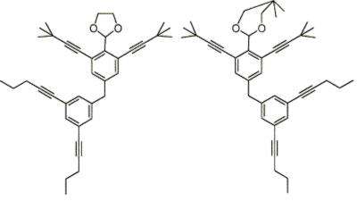

# Nomenclature Namer
1. To help GCSE students with Organic Chemistry
2. To provide a useful revision resource for GCSE and A1 students
3. To bridge the gap between GCSE and A-Level Chemistry
---
Molecules are stored as graphs with atoms as nodes and bonds as edges. The graph is then traversed to find the longest carbon chain and the functional groups are identified. The name is then constructed from the functional groups and the longest carbon chain. The tool will be flexible and easy to use, being developed for and by students.
### In the meantime- GCSE nomenclature is best taught [here](https://www.chemguide.co.uk/basicorg/conventions/names.html).
 

