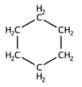
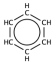
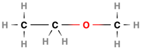
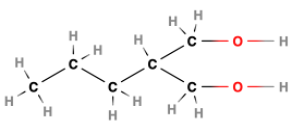
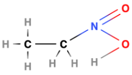
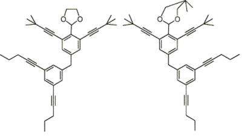

# Nomenclature Namer
## Introduction
This tool converts the structure of a molecule into its IUPAC name. It was created for the following purposes:
1. To help beginners practice Organic Chemistry naming conventions
2. To provide a useful revision resource for GCSE and A1 students
3. To provide a free and open-source tool for anyone to play around with the nuances and limits of Organic Chemistry nomenclature

Molecules are stored as graphs with atoms as nodes and bonds as edges. The graph is then traversed to find the longest carbon chain and the functional groups are identified. The name is then constructed using the rules partly outlined [here](resources/IUPAC_brief_guide_2021.pdf). The tool is very lightweight and the CLI is intuitive to use.

## Guide for Use
For large molecules, or inexperienced users, the process is easiest if you have access to an image of the displayed structure of the molecule to keep track of.
1. The program starts by assuming the molecule is organic and contains a carbon atom. Choose any carbon atom in your molecule and this is your starting point, however a carbon on one of the 'ends' of the molecule is easier to keep track of.
2. The program is asking for you to describe another atom that is bonded to this first carbon atom. To do this, choose any neighboring atom and input its elemental symbol, for example 'C' for carbon, 'H' for hydrogen, 'O' for oxygen etc.
3. The program may ask you to clarify the type of bond between the two atoms, for example single, double etc. Input 1, 2, etc respectively.
4. The program will then repeatedly ask you variations of the above questions until the entire molecule has been described, at which point it will recognise the completeness of the graph and terminate automatically, outputting the IUPAC name of the molecule.

Although the input operates in an intuitive 'breadth-first' style, keeping track of which atom the program is referring to can be confusing for large molecules. In this case, it may be helpful to label atoms of each type with numbers as they are described to the program. For example, the first carbon is labelled 1, the second is labelled 2, the first oxygen is labelled 1 and so on. This way, when the program asks you to return to the fourth oxygen atom you mentioned, you can easily identify it with the number 4. This is more relevant for those playing around with the software and testing its limits, as GCSE molecules are generally small enough to keep track of mentally.

Advanced users can use the tool to create custom JSON files to customise some of the naming rules used, or the elements available. These custom chemistries are for experimentation only, and the defaults can be restored easily.

### GUI coming soon, but in the mean time GCSE nomenclature is best taught [here](https://www.chemguide.co.uk/basicorg/conventions/names.html).

## Limitations
The currrent implimentation of some algorithms mean that the carbon atoms must form a tree. Compounds that violate this cannot be named currently, although this may change in a future update. The following are an exhaustive list of the types of molecules that cannot be named currrently:
1. Cyclic compounds (cannot be input)     
2. Aromatic compounds (cannot be input)     
3. Molecules that break the carbon chain (eg esters, secondary amines) (parsing error)     

These molecules show up in GCSE/A1 at a very simple level, and past exam questions should be sufficient for practicing their nomanclature.
The following molecules also trigger parse errors for different reasons, but are more rare...

4. Carbon branches with functional groups     
5. Functional groups contianing two or more atoms bonded together that are not carbon or hydrogen (eg nitro, sulfo compounds). This can be resolved by treating the group as one novel atom and editing the periodic table and spec files, as the program is  unable to traverse deeply into inorganic chemistry in polyatomic functional groups.     
---

### The design documentation for this project can be found [here](resources/design_documentation_no_code.pdf) and was awarded 96% by independent moderators.

 

## License
This project is licensed under the MIT License – see the [LICENSE](LICENSE) file for details.
